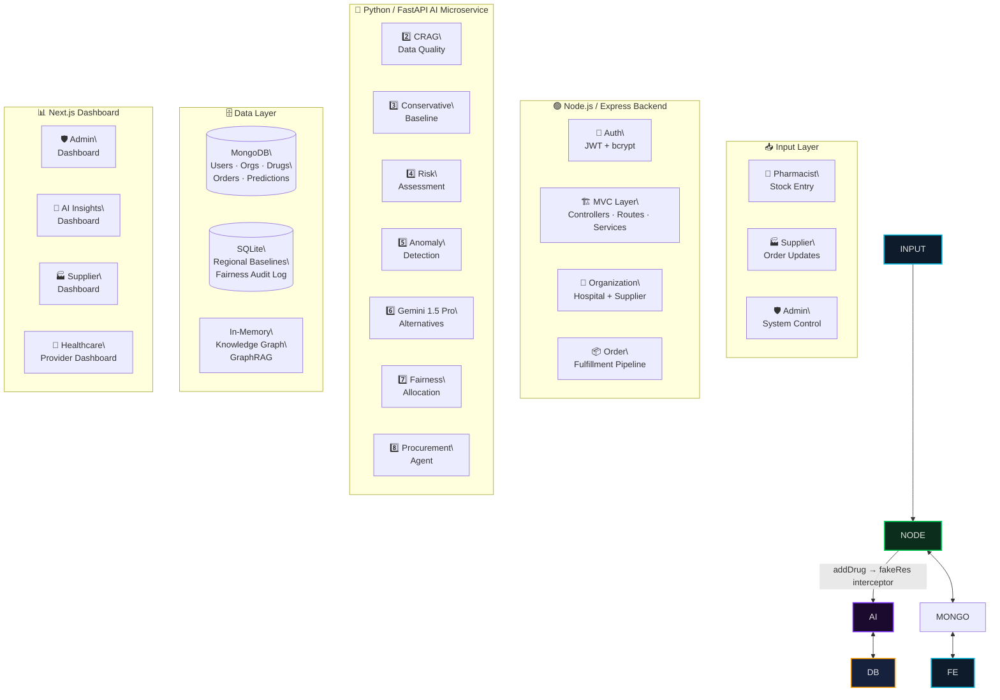
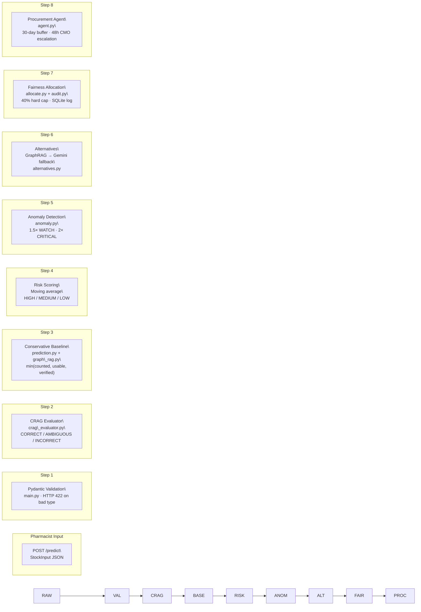
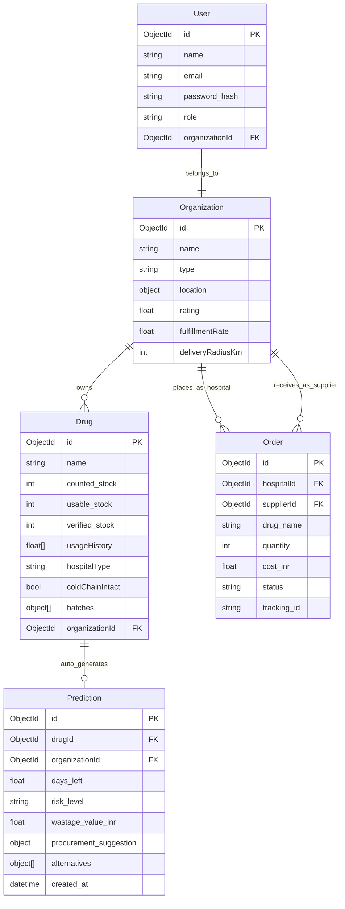

<h1 align="center">💊 PharmaSight</h1>

<p align="center">
  <strong>AI-Powered Pharmaceutical Supply Chain Intelligence — Eliminating Drug Shortages Before Patients Pay the Price</strong>
</p>

<p align="center">
  <a href="#-live-demo--deployment"></a>
  <a href="#-live-demo--deployment"></a>
  <a href="LICENSE"></a>
  <a href="#-tech-stack--tools"></a>
  <a href="#-tech-stack--tools"></a>
  <a href="#-tech-stack--tools"></a>
</p>

<p align="center">
  <em>Built for the <strong>Google Solution Challenge 2026</strong> — Track: <strong>Smart Supply Chains · Open Innovation</strong></em>
</p>

\---

## 📋 Table of Contents

* [Problem Statement](#-the-problem)
* [Our Solution](#-our-solution)
* [System Architecture](#-system-architecture)
* [Research \& Concept Docs](#-research--concept-docs)
* [AI Pipeline](#-ai-pipeline-deep-dive)
* [Frontend Dashboard](#-frontend-dashboard)
* [Tech Stack \& Tools](#-tech-stack--tools)
* [Getting Started](#-getting-started)
* [Live Demo \& Deployment](#-live-demo--deployment)
* [Demo Walkthrough](#-demo-walkthrough)

\---

## 🔥 The Problem

Drug shortages kill — not from lack of medicine, but from **broken information**. Government hospitals in rural India operate on phantom inventories, paper-based reporting, and no predictive capability.

|Pain Point|Impact|Scale|
|-|-|-|
|👻 **Phantom Stock**|Medicine logged as available doesn't exist|Rs. 1,000+ crore lost annually|
|🧊 **Cold-Chain Failures**|Temperature-sensitive drugs spoil undetected|Insulin, Oxytocin, Vaccines compromised|
|📄 **Paper-Based Reporting**|Forms submitted days late, data already stale|>72h reporting lag in PHCs|
|⚖️ **Inequitable Allocation**|Urban hospitals hoard surplus during scarcity|Rural facilities left without supply|
|🔮 **Zero Predictive Capability**|Shortages discovered when patients arrive|No early warning system exists|

> \*\*The result?\*\* District hospitals in Odisha log phantom inventory, submit paper forms days late, and miss cold-chain failures until patients arrive to empty shelves. No system exists to predict, prevent, or equitably resolve these shortages.

\---

## 💡 Our Solution

**PharmaSight** is a compound AI system that acts as a **pharmacist's intelligent co-pilot** — predicting shortages before they happen, detecting bad data before it corrupts decisions, and ensuring every drug unit reaches the facility that needs it most.

* 🧠 **CRAG layer** auto-corrects toxic pharmacist data before it enters the prediction engine
* 🕸 **GraphRAG** maps shortage ripple effects across 4+ neighbouring facilities in real time
* 💬 **Gemini 1.5 Pro** generates clinically validated alternatives calibrated to rural formulary constraints
* 📊 **8-step pipeline** delivers days-left, risk level, anomaly flag, alternatives, and a draft procurement order in a single API response
* ⚖️ **Fairness by design** — rural (+0.3) and low-income (+0.2) priority boosts with a 40% hard cap enforced on every allocation run
* 💰 **Rs. 0 to run** at MVP scale — Gemini free tier, SQLite, zero paid ML platforms

### Before vs After

||Before PharmaSight|After PharmaSight|
|-|-|-|
|**Stock Awareness**|Paper register, manual count|Real-time `min(counted, usable, verified)` baseline|
|**Shortage Warning**|Discovered when shelf is empty|Predicted 7–14 days in advance|
|**Bad Data**|Reaches decisions unchecked|CRAG auto-replaces with regional baselines|
|**Drug Alternatives**|Doctor's memory|3 Gemini-generated alternatives with match %|
|**Allocation**|First-come first-served|Equity-weighted, hard-capped, fully audited|
|**Procurement**|Manual, days late|Draft order auto-generated, 48h CMO escalation|

\---

## 🏗 System Architecture

PharmaSight runs a **two-service architecture**: a Node.js/Express backend handling multi-tenant auth, hospital/supplier management, and data persistence — and a Python/FastAPI AI microservice running the 8-step compound prediction pipeline. Both services share the same MongoDB data layer via internal API calls.

### High-Level System Flow



### Data Flow \& Agent Communication



### Database Entity Relationship



> \*\*AI Service (Python / SQLite):\*\* Maintains separate `regional\_baselines` and `fairness\_audit\_log` tables in SQLite. GraphRAG knowledge graph runs in-memory — `MediTraceGraph` in `graph\_rag.py`.

\---

## 📚 Research \& Concept Docs

|Document|Description|
|-|-|
|📑 **CRAG Architecture**|Three-path corrective RAG: data freshness thresholds (>72h), phantom stock gap detection (>30%), coefficient-of-variation volatility scoring|
|🕸 **GraphRAG Design**|In-memory knowledge graph mapping Drugs ↔ Suppliers ↔ Facilities ↔ Regions. Ripple risk, seasonal 1.35× demand multiplier, cold-chain blast-radius propagation|
|⚖️ **Fairness Allocation Model**|Priority-weighted distribution: rural (+0.3), low-income (+0.2), 40% hard cap per facility. 30-day audit trail via `GET /fairness-audit`|
|🧊 **Conservative Stock Logic**|`effective\_stock = min(counted, usable, verified)`. 60-day expiry window subtracted. Cold-chain failure zeros out insulin, oxytocin, vaccines immediately|
|🤖 **Gemini Integration**|GraphRAG-first lookup (zero latency, zero cost). Gemini 1.5 Pro fallback returns structured JSON: `\[{drug, match\_pct, key\_difference}]` — calibrated to rural Indian PHC formulary|
|🛡 **Phantom Stock Detection**|Gap >15% → data reliability warning appended. Gap >30% → CRAG marks INCORRECT, replaces with SQLite regional baseline. Gap >15% (procurement) → auto-escalation flag|

\---

## 🤖 AI Pipeline Deep-Dive

The entire prediction flow runs as a single `POST /predict` call. Each step feeds into the next — the output of CRAG determines what goes into the risk calculator, which determines whether Gemini fires at all. Here's the full chain at a glance:

|Step|What it does|Key output|
|-|-|-|
|**1. Input Validation**|Rejects malformed data before any AI runs|Clean `StockInput` or HTTP 422|
|**2. CRAG Quality Check**|Scores data trustworthiness; replaces bad data with verified baselines|`CORRECT` / `AMBIGUOUS` / `INCORRECT` verdict|
|**3. Conservative Baseline**|Picks the safest stock number; subtracts expiring and compromised batches|`effective\_stock` — always the worst-case count|
|**4. Risk Assessment**|Calculates days of supply left; applies GraphRAG seasonal multiplier|`days\_left` + `HIGH` / `MEDIUM` / `LOW`|
|**5. Anomaly Detection**|Flags usage spikes that could mean an outbreak or drug diversion|`NORMAL` / `WATCH` / `CRITICAL`|
|**6. Gemini Alternatives**|Finds substitute drugs (GraphRAG first, Gemini as fallback)|3 alternatives with `match\_pct`|
|**7. Fairness Allocation**|Distributes available stock with rural/low-income priority boosts|Equity-weighted units per hospital|
|**8. Procurement Agent**|Drafts a supplier order and starts a 48h CMO escalation timer|Draft order — never auto-sent|

\---

### Step 1 — Input Validation

> \*\*Module:\*\* `main.py` · \*\*Endpoint:\*\* `POST /predict`

Every prediction request starts here. FastAPI's Pydantic model validates every field automatically — wrong type, missing field, or bad shape returns HTTP 422 immediately. **No bad data ever enters the AI pipeline.**

\---

### Step 2 — CRAG Quality Check

> \*\*Module:\*\* `crag\_evaluator.py`

**The problem it solves:** A pharmacist enters 500 units of Amoxicillin, but the last physical audit showed 120. That 75% gap is a red flag — the "500" is probably phantom stock. CRAG catches this before the gap corrupts the risk score.

CRAG evaluates three signals simultaneously: how stale the data is, how large the counted-vs-verified gap is, and how volatile historical usage has been.

|Classification|Trigger|What happens|
|-|-|-|
|✅ **CORRECT**|Fresh data, gap <15%, stable usage|Proceed with pharmacist's numbers|
|⚠️ **AMBIGUOUS**|Gap 15–30% or high usage volatility|Flag + `human\_review\_required: true` in response|
|❌ **INCORRECT**|Data older than 30 days or gap >30%|Discard input; hot-swap with verified SQLite regional baseline|

> \*\*Why this matters:\*\* In rural PHCs, pharmacists often estimate stock from memory. CRAG ensures a bad estimate never triggers a false "we're fine" and lets a patient arrive to an empty shelf.

\---

### Step 3 — Conservative Baseline

> \*\*Module:\*\* `prediction.py` + `graph\_rag.py`

**The problem it solves:** Three people counted the same shelf and got three different numbers. Which one do we trust? We don't trust any of them — we take the lowest.

This step also subtracts any batches expiring within 60 days (unusable soon), and immediately zeros out cold-chain drugs if refrigeration has failed.

> \*\*Why this matters:\*\* Overestimating stock is how hospitals end up with empty shelves and no warning. PharmaSight always plans for less.

\---

### Step 4 — Risk Assessment

> \*\*Module:\*\* `prediction.py`

**The problem it solves:** How many days of medicine do we actually have left? And is that dangerous?

The moving average of `daily\_usage` gives a realistic consumption rate. Divide effective stock by that rate to get days remaining. The seasonal multiplier from GraphRAG inflates the denominator during high-demand months — so a 30-day supply of malaria drugs during monsoon season might actually be a 22-day supply.

> \*\*Why this matters:\*\* HIGH risk is the trigger that unlocks Steps 6 and 8. The system doesn't spam pharmacists with procurement orders — it waits until the math says there's a real problem.

\---

### Step 5 — Anomaly Detection

> \*\*Module:\*\* `anomaly.py` · \*\*Endpoint:\*\* `POST /anomaly`

**The problem it solves:** Normal shortage prediction looks at supply. Anomaly detection looks at demand — specifically, whether demand just spiked in a way that looks suspicious.

A 2× usage spike in a small PHC isn't normal variation. It might mean a disease outbreak, data entry error, or — in some cases — drug diversion.

|Spike Ratio|Severity|What it likely means|
|-|-|-|
|< 1.5×|NORMAL|Expected day-to-day variation|
|1.5× – 2×|WATCH|Elevated usage — worth monitoring|
|> 2×|CRITICAL|Possible outbreak, data error, or diversion|

> This endpoint runs \*\*independently\*\* from `/predict` so it can be polled on a schedule without triggering a full prediction.

\---

### Step 6 — Gemini 1.5 Pro Alternatives

> \*\*Module:\*\* `alternatives.py` · \*\*Endpoint:\*\* `POST /alternatives` · \*\*Triggered on:\*\* HIGH risk only

**The problem it solves:** When a drug runs out at a rural hospital, the pharmacist often relies on memory to suggest substitutes. PharmaSight automates this with clinically aware alternatives — calibrated specifically to the rural Indian PHC formulary.

GraphRAG is always checked first. If the knowledge graph already has substitute data for this drug and region, the answer comes back instantly at zero cost. Gemini 1.5 Pro is only called when there's no local data.

> \*\*Why this matters:\*\* Gemini is prompted to return structured JSON with a `match\_pct` and `key\_difference` per alternative — not a wall of text that a pharmacist has to parse under pressure.

\---

### Step 7 — Fairness Allocation

> \*\*Module:\*\* `allocate.py` + `audit.py` · \*\*Endpoint:\*\* `POST /allocate`

**The problem it solves:** When supply is limited, urban hospitals with better procurement teams tend to get the most. Rural and low-income facilities get whatever's left. PharmaSight makes equity non-negotiable.

Every allocation run bakes in priority boosts for rural (+0.3) and low-income (+0.2) facilities. A 40% hard cap prevents any single hospital — no matter how high its priority score — from hoarding more than 40% of available stock.

Every run is logged to SQLite and surfaced via `GET /fairness-audit` as a 30-day equity score.

> \*\*Why this matters:\*\* The +0.3 and +0.2 boosts are hardcoded, not configurable. This is intentional — fairness isn't a slider an admin can turn off.

\---

### Step 8 — Autonomous Procurement Agent

> \*\*Module:\*\* `agent.py` · \*\*Triggered on:\*\* HIGH risk

**The problem it solves:** When a pharmacist gets a HIGH risk alert, the next step is manually calling a supplier, negotiating quantity, and raising a purchase order — a process that takes days in paper-based systems. PharmaSight generates that order instantly and starts a countdown.

GraphRAG picks the best supplier for the drug and region by reliability score. If GraphRAG has no data, it falls back to a known supplier registry.

The draft order is **never auto-sent** — a pharmacist must confirm it. The 48h timer ensures it can't be silently ignored either.

> \*\*Why this matters:\*\* The system catches the shortage, builds the order, and holds the pharmacist accountable — without taking their agency away.

\---

## 🖥 Frontend Dashboard

Four purpose-built dashboards — Next.js + Leaflet.js:

|Dashboard|Audience|Key Features|
|-|-|-|
|🛡 **Admin Dashboard**|System administrators|Hospital node management, global AI behavior toggles, live infra health across all facilities|
|🤖 **AI Insights Dashboard**|Pharmacists \& analysts|RAG-sourced root cause analysis, real-time anomaly spikes, model confidence score, full decision audit trail|
|🏭 **Supplier Dashboard**|Drug suppliers|Incoming orders, status pipeline (Pending → Processing → Dispatched), auto-generated tracking IDs, Fairness Scoreboard|
|🏥 **Healthcare Provider Dashboard**|Hospital pharmacists|Inventory table + bulk upload, AI stockout predictions with confidence scores, High-Risk Drug Warning Banners, real-time order tracking|

**Design Highlights:**

* 🗺 **Leaflet.js district risk map** — real-time HIGH / MEDIUM / LOW markers per district
* 📊 **Confidence scores** surfaced on every AI prediction — no black-box outputs
* 🚨 **High-Risk Warning Banners** — persistent alerts until acknowledged
* 📦 **Bulk data upload** — CSV support for multi-drug batch entry

\---

## 🛠 Tech Stack \& Tools

### AI Microservice (Python · FastAPI · Port 8001)

|Layer|Technology|Purpose|
|-|-|-|
|Web framework|FastAPI + Uvicorn|Async endpoints, automatic OpenAPI docs|
|Input validation|Pydantic v2|Schema enforcement before any AI runs|
|Core prediction|Python `statistics` stdlib|Moving average, no heavy ML dependency|
|Data quality|CRAG (`crag\_evaluator.py`)|3-path corrective RAG — correct / ambiguous / incorrect|
|Knowledge graph|GraphRAG (`graph\_rag.py`)|In-memory drug ↔ supplier ↔ facility graph|
|LLM|Gemini 1.5 Pro (`google-generativeai`)|Drug alternatives, calibrated to rural PHC formulary|
|Persistence|SQLite (`sqlite3` stdlib)|Regional baselines, fairness audit log, escalation log|
|Environment|`python-dotenv`|`GEMINI\_API\_KEY` kept out of code|

**Full `requirements.txt`:**

```
fastapi==0.111.0
uvicorn==0.29.0
pydantic==2.7.0
python-dotenv==1.0.1
google-generativeai==0.5.4
```

Everything else (`datetime`, `statistics`, `sqlite3`, `json`, `os`) is Python stdlib — zero extra installs.

### Backend (Node.js · Express · Port 5000)

|Layer|Technology|Purpose|
|-|-|-|
|Runtime|Node.js 20+|JavaScript backend|
|Framework|Express 5|REST API, route handling|
|Database|MongoDB + Mongoose|Users, organizations, drugs, orders, predictions|
|Auth|JWT + bcryptjs|Stateless auth, password hashing|
|AI bridge|`ai.service.js` + `fakeRes` interceptor|Calls Python AI microservice on every `addDrug`|
|Config|dotenv|`MONGO\_URI`, `JWT\_SECRET`, `AI\_SERVICE\_URL`|

### Frontend (Next.js 14 · Port 3000)

|Layer|Technology|Purpose|
|-|-|-|
|Framework|Next.js 14|React SSR, app router|
|Maps|Leaflet.js|District-level risk map|
|Charts|Recharts / Chart.js|Fairness audit bar charts, usage trends|
|Auth flow|JWT Bearer token|Passed in `Authorization` header on every request|

\---

## 🚀 Getting Started

### Prerequisites

```bash
Node.js 20+    # backend + frontend
Python 3.10+   # AI microservice
MongoDB Atlas  # free tier is enough for demo
```

### 1\. Clone

```bash
git clone https://github.com/Pharma-Sight/pharmasight.git
cd pharmasight
```

### 2\. AI Microservice (Python)

```bash
cd pharmasight-ai
pip install fastapi uvicorn pydantic python-dotenv google-generativeai

cp .env.example .env
# Add your GEMINI\_API\_KEY from https://aistudio.google.com (free tier, no credit card)

uvicorn main:app --reload --host 0.0.0.0 --port 8001
```

### 3\. Node.js Backend

```bash
cd pharmasight-backend
npm install

cp .env.example .env
# Fill in MONGO\_URI, JWT\_SECRET, AI\_SERVICE\_URL=http://localhost:8001

npm start
```

### 4\. Frontend

```bash
cd pharmasight-frontend
npm install

cp .env.example .env.local
# Set NEXT\_PUBLIC\_API\_URL=http://localhost:5000

npm run dev
```

Open `http://localhost:3000`.

### Environment Variables

```env
# AI Service (Python)
GEMINI\_API\_KEY=your\_google\_ai\_studio\_key
DATABASE\_URL=sqlite:///./pharmasight.db

# Node.js Backend
MONGO\_URI=mongodb+srv://your\_atlas\_uri
JWT\_SECRET=your\_jwt\_secret\_min\_32\_chars
AI\_SERVICE\_URL=http://localhost:8001
PORT=5000

# Frontend
NEXT\_PUBLIC\_API\_URL=http://localhost:5000
```

\---

## 🌐 Live Demo \& Deployment

|Component|URL|
|-|-|
|🖥 **Frontend** (Vercel)|[pharma-sight-website.vercel.app](https://pharma-sight-website.vercel.app/)|
|🎬 **Demo Video** (3 min)|[youtu.be/-mBV2xtuytg](https://youtu.be/-mBV2xtuytg?si=6ptNt8J87ytfiqs9)|
|🐙 **GitHub**|[github.com/Pharma-Sight](https://github.com/Pharma-Sight)|

### Deployment Costs

|Phase|Infrastructure|Monthly Cost|
|-|-|-|
|**Hackathon / Demo**|Local Python + MongoDB Atlas free tier + Gemini free tier|**Rs. 0**|
|**Pilot (1–5 hospitals)**|Google Cloud Run + Gemini API (low volume)|Rs. 2,500–4,000|
|**Statewide Rollout**|Cloud Run auto-scaling + Cloud Spanner + Vertex AI Forecast|Rs. 23,000–33,000|

\---

## 🎬 Demo Walkthrough

Follow this sequence to see PharmaSight's full prediction pipeline:

### Step 1: Pharmacist Submits Stock Data

1. Log in to the **Healthcare Provider Dashboard**
2. Enter stock data: drug name, three count fields, daily usage history, batch expiry dates, cold-chain status
3. Hit **Submit** — `POST /predict` fires immediately

### Step 2: CRAG Validates Data Quality

4. Watch the AI Insights Dashboard — CRAG classification appears: CORRECT / AMBIGUOUS / INCORRECT
5. If INCORRECT: note that regional SQLite baselines automatically replaced the raw input — bad data never reached the risk engine

### Step 3: Review Risk Assessment

6. See the prediction output: **days left**, **risk level** (HIGH / MEDIUM / LOW), **wastage value in ₹**
7. If gap >15%: notice the **data reliability warning** appended to the result
8. Check for **expiring batches** flagged in the 60-day window

### Step 4: See Alternatives (HIGH Risk Only)

9. If risk = HIGH: three drug alternatives appear with `match\_pct` and `key\_difference`
10. Notice the `source` field — `graph` (GraphRAG local, instant) or `gemini` (API fallback)

### Step 5: Check Anomaly Detection

11. Navigate to `POST /anomaly` output — see `spike\_ratio` and severity (NORMAL / WATCH / CRITICAL)
12. CRITICAL flag indicates >2× usage spike — possible outbreak or drug diversion

### Step 6: Review Fairness Allocation

13. Open the **Fairness Audit** via `GET /fairness-audit`
14. Confirm rural and low-income facilities received priority boosts
15. Verify no single facility exceeded 40% of total allocated stock

### Step 7: Procurement Agent Draft

16. On HIGH risk: see the auto-generated procurement order — supplier, quantity (30-day buffer), cost in ₹, lead time
17. Pharmacist confirms or rejects — order is **never auto-sent**
18. If unacknowledged for 48h: CMO escalation triggers automatically

### Step 8: Supplier Dashboard

19. Log in as a Supplier — see incoming hospital orders
20. Update status: Pending → Processing → Dispatched
21. Tracking ID auto-generated on dispatch

\---

## 🔌 API Reference

### AI Service (Python · FastAPI · Port 8001)

|Method|Endpoint|Description|
|:-:|-|-|
|`POST`|`/predict`|Full 8-step prediction pipeline|
|`POST`|`/anomaly`|Usage spike detection (independent)|
|`POST`|`/alternatives`|Drug alternatives · GraphRAG → Gemini|
|`POST`|`/allocate`|Fairness-weighted stock allocation|
|`GET`|`/fairness-audit`|30-day equity audit log|

### Node.js Backend (Express · Port 5000)

|Method|Endpoint|Description|
|:-:|-|-|
|`POST`|`/api/auth/register`|Register user + auto-seed organization|
|`POST`|`/api/auth/login`|Login · returns JWT|
|`GET`|`/api/auth/getUser`|Get logged-in user profile|
|`POST`|`/api/drugs`|Add drug → auto-triggers AI prediction|
|`GET`|`/api/drugs`|List all drugs for organization|
|`GET`|`/api/predictions`|Get all predictions for organization|
|`POST`|`/api/orders`|Create procurement order|
|`POST`|`/api/orders/bulk`|Create multiple orders at once|
|`GET`|`/api/orders`|List orders for hospital/supplier|
|`PATCH`|`/api/orders/:id/dispatch`|Supplier dispatch · generate tracking ID|
|`GET`|`/api/organizations`|List all organizations|

\---

## 📁 Project Structure

```
PharmaSight/
├── 📂 pharmasight-ai/               # Python AI Microservice
│   ├── main.py                      # FastAPI entry point · POST /predict
│   ├── crag\_evaluator.py            # CRAG: 3-path data quality classifier
│   ├── prediction.py                # Conservative baseline + risk scoring
│   ├── anomaly.py                   # Spike detection · POST /anomaly
│   ├── alternatives.py              # Gemini 1.5 Pro fallback · POST /alternatives
│   ├── graph\_rag.py                 # In-memory GraphRAG knowledge graph
│   ├── allocate.py                  # Fairness allocation · POST /allocate
│   ├── audit.py                     # SQLite fairness audit logger
│   ├── agent.py                     # Procurement agent · 48h CMO escalation
│   ├── pharmasight.db               # SQLite: regional baselines + audit log
│   ├── requirements.txt
│   └── .env.example
├── 📂 pharmasight-backend/          # Node.js / Express Backend
│   ├── 📂 models/
│   │   ├── user.model.js            # User schema · role enum · org reference
│   │   ├── organization.model.js    # Hospital + supplier profiles
│   │   ├── drug.model.js            # Stock · batches · cold-chain · usage history
│   │   ├── order.model.js           # Hospital ↔ supplier order lifecycle
│   │   └── prediction.model.js      # AI output storage
│   ├── 📂 controllers/
│   │   ├── auth.controller.js       # Register · login · org auto-seed · getUser
│   │   ├── drug.controller.js       # addDrug → AI trigger · savePrediction
│   │   ├── order.controller.js      # Create · bulk create · dispatch · fulfillment
│   │   ├── organization.controller.js # Org listing and management
│   │   └── prediction.controller.js # Prediction storage and retrieval
│   ├── 📂 routes/
│   ├── 📂 middleware/
│   │   └── auth.middleware.js       # JWT protect · Bearer token · req.user
│   ├── 📂 services/
│   │   └── ai.service.js            # Internal AI service caller · fakeRes interceptor
│   ├── package.json
│   └── .env.example
├── 📂 pharmasight-frontend/         # Next.js Frontend
│   ├── 📂 app/
│   │   ├── 📂 admin/                # Admin dashboard
│   │   ├── 📂 insights/             # AI Insights dashboard
│   │   ├── 📂 supplier/             # Supplier order management
│   │   └── 📂 provider/             # Healthcare provider dashboard
│   ├── 📂 components/
│   │   ├── RiskMap.jsx              # Leaflet.js district risk map
│   │   ├── StockTable.jsx           # Inventory with bulk upload
│   │   └── PredictionCard.jsx       # AI output display
│   └── package.json
└── README.md
```

\---

## ✅ Hackathon Acceptance Criteria Mapping

|Criteria|Status|How PharmaSight Addresses It|
|-|:-:|-|
|AI-powered prediction|✅|8-step compound AI pipeline: CRAG → GraphRAG → Gemini → Fairness|
|Data quality handling|✅|CRAG 3-path evaluator auto-replaces corrupt data with SQLite baselines|
|Shortage prediction|✅|Moving average risk scoring: HIGH (<7 days), MEDIUM (<14 days), LOW|
|Anomaly detection|✅|Spike ratio: 1.5× WATCH, 2× CRITICAL — independent endpoint|
|Drug alternatives|✅|GraphRAG-first, Gemini 1.5 Pro fallback — structured JSON output|
|Fairness / equity|✅|Rural +0.3, low-income +0.2, 40% hard cap, 30-day audit trail|
|Autonomous agent|✅|Procurement draft auto-generated on HIGH risk, 48h CMO escalation|
|Multi-tenant auth|✅|JWT + bcrypt, org auto-seed on registration, tenant-isolated data|
|Real-time map|✅|Leaflet.js district risk map with live HIGH/MEDIUM/LOW markers|
|Zero-cost MVP|✅|Gemini free tier + SQLite + Python stdlib — Rs. 0 to run|
|Open Innovation track|✅|Purpose-built for Odisha PHCs, globally portable to any low-resource system|

\---

<p align="center">
  <strong>Built for Google Solution Challenge 2026 — Smart Supply Chains · Open Innovation</strong>
</p>

<p align="center">
  <em>"Drug shortages kill. Not from lack of medicine — from broken information. PharmaSight eliminates this gap."</em>
</p>

